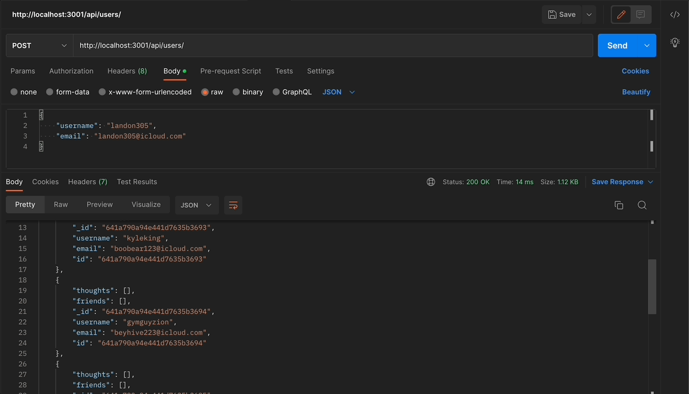

  # Social Network API - NoSQL
  

  ## Table of Contents
  * [Description](#description)
  * [Installation](#installation)
  * [Usage](#usage)
  * [Contributors](#contributors)
  * [Test](#test)
  * [Questions](#questions)
  * [Mock](#mock)


  
* [License](#license)

    
  ## Description
  API for a social network web application where users can share their thoughts, react to friends’ thoughts, and create a friend list.

  ## User Story

  ```md
  AS A social media startup
  I WANT an API for my social network that uses a NoSQL database
  SO THAT my website can handle large amounts of unstructured data
  ```

  ## Acceptance Criteria

  ```md
  GIVEN a social network API
  WHEN I enter the command to invoke the application
  THEN my server is started and the Mongoose models are synced to the MongoDB database
  WHEN I open API GET routes in Insomnia for users and thoughts
  THEN the data for each of these routes is displayed in a formatted JSON
  WHEN I test API POST, PUT, and DELETE routes in Insomnia
  THEN I am able to successfully create, update, and delete users and thoughts in my database
  WHEN I test API POST and DELETE routes in Insomnia
  THEN I am able to successfully create and delete reactions to thoughts and add and remove friends to a user’s friend list
  ```
 
  
  ## Installation
  To install, clone the repo and in your terminal code `npm i` to download node_modules and run `npm start`.
  ## Usage
  API for a social network web application where users can share their thoughts, react to friends’ thoughts, and create a friend list.
  ## Contributors
  Landon M.
  ## License
  MIT License
  ## Test
  API for a social network web application where users can share their thoughts, react to friends’ thoughts, and create a friend list.

  ## Questions
  * Github : [Landon Murray](https://github.com/LandoBM/)
  * E-Mail :landon.swdeveloper@gmail.com

  ## Mock
  
  .gif)
  .gif)


  ## License
    Licensed using MIT License.
  
  ## Walkthrough
  [Social API](https://drive.google.com/file/d/1tfz0eDo_lWaseZILM8VF_whFxjKXSMlT/view)

---
© 2023 edX Boot Camps LLC. Confidential and Proprietary. All Rights Reserved.
